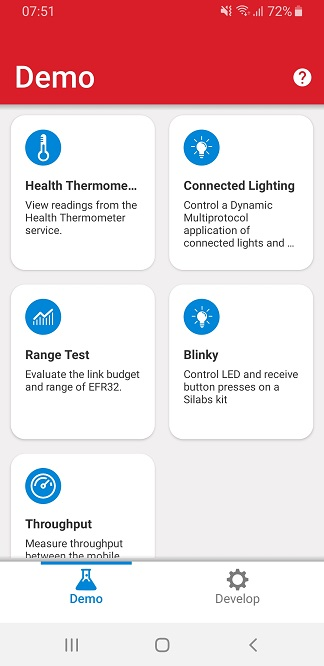

# SoC - Blinky

This sample application is the "Hello World" of Bluetooth Low Energy (BLE). It allows a BLE central device to control the LED on the kit and receive button press notifications.

## Getting started

To get started with Bluetooth and Simplicity Studio, please refer to [QSG169: Bluetooth® SDK v3.x Quick Start Guide](https://www.silabs.com/documents/public/quick-start-guides/qsg169-bluetooth-sdk-v3x-quick-start-guide.pdf).

This example implements a simple custom GATT service with two characteristics. One characteristic controls the state of the LED (ON/OFF) via write operations from a GATT client, and the second characteristic will send notifications to subscribed clients when the button state changes (pressed or released).

To test this demo install EFR Connect for [Android](https://play.google.com/store/apps/details?id=com.siliconlabs.bledemo&hl=en&gl=US) or [iOS](https://apps.apple.com/us/app/efr-connect/id1030932759). Source code for the mobile app is available on [Github](https://github.com/SiliconLabs?q=efrconnect&type=&language=&sort=).

After launching the app go to the demo view and select the Blinky demo. A pop-up will show all the devices around you which are running the SoC-Blinky firmware. Tap on the device to go into the demo view.

 

Tap the light on the mobile app to toggle the LED on the kit, and when you press/release the button on the kit the state will change for the virtual button on the app as well.

  

The animation below showcases the demo running on a BGM220 Explorer Kit (BGM220-EK4314A) with the mobile app running on an Android device.

## Troubleshooting

Note that __NO__ Bootloader is included in any Software Example projects, but they are configured so, that they expect a bootloader to be present on the device. To get your application work, you should either
- flash a bootloader to the device or
- uninstall the **OTA DFU** and **Bootloader Application Interface** software components.

To flash a bootloader, you should either create a bootloader project or run a precompiled **Demo** on your device from the Launcher view. Precompiled Demos flash both bootloader and application images to your device.

- To flash an OTA DFU capable bootloader to your device, *SoC-Thermometer* demo can be flashed before your application to load the bootloader.
- To flash a UART DFU capable bootloader to your device, *NCP-Empty* demo can be flashed before your application to load the bootloader.
- For your custom application, create your own bootloader project and flash it to your device before flashing your application.
- When you flash your application image to the device, use the *.hex* or *.s37* output file. Flashing *.bin* files may overwrite (erase) the bootloader.
- On Series 1 devices (EFR32xG1x), both first stage and second stage bootloaders have to be flashed. This can be done at once by flashing the **-combined.s37* file found in your bootloader project after building the project.
- For more information, see *[UG103: Bootloading fundamentals](https://www.silabs.com/documents/public/user-guides/ug103-06-fundamentals-bootloading.pdf)* and *[UG266: Silicon Labs Gecko Bootloader User's Guide](https://www.silabs.com/documents/public/user-guides/ug266-gecko-bootloader-user-guide.pdf)*.

Before programming the radio board mounted on the WSTK, make sure the power supply switch the AEM position (right side) as shown below.

## Resources

[Bluetooth Documentation](https://docs.silabs.com/bluetooth/latest/)

[UG103.14: Bluetooth® LE Fundamentals](https://www.silabs.com/documents/public/user-guides/ug103-14-fundamentals-ble.pdf)

[QSG169: Bluetooth® SDK v3.x Quick Start Guide](https://www.silabs.com/documents/public/quick-start-guides/qsg169-bluetooth-sdk-v3x-quick-start-guide.pdf)

[UG434: Silicon Labs Bluetooth ® C Application Developer's Guide for SDK v3.x](https://www.silabs.com/documents/public/user-guides/ug434-bluetooth-c-soc-dev-guide-sdk-v3x.pdf)

[Bluetooth Training](https://www.silabs.com/support/training/bluetooth)

## Report Bugs & Get Support

You are always encouraged and welcome to report any issues you found to us via [Silicon Labs Community](https://www.silabs.com/community).